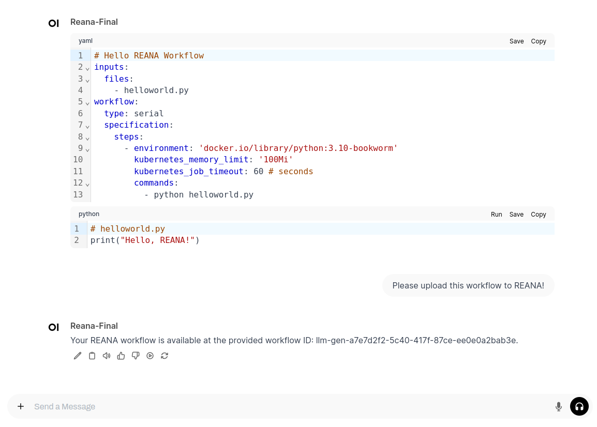
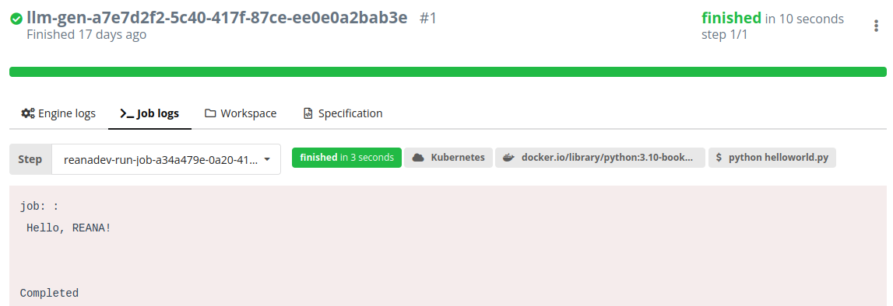

# Bachelor Thesis: Enhancing Data Workflows and Reproducibility with LLM Agents

This repository contains the source code, Docker configurations, and abstract of the underlying thesis by E. T. L. Strauß.

## Thesis Topic :exclamation:
**"Enhancing Data Workflows and Reproducibility with LLM Agents"**

## Thesis Question :question:
**"How effective are LLMs with RAG and Agents in improving data analysis pipelines in terms of effectiveness and accuracy in astrophysics?"**

## Abstract :book:
This thesis presents a proof of concept for using Large Language Models (LLMs) with modern technologies to automate the generation of workflows for the data analysis platform [REANA](https://reana.io/). The feasibility of such a system is tested through a prototype implementation. This work provides insights into both the theoretical principles underpinning the implementation and the practical use of the prototype, highlighting the challenges that need to be addressed to build a production-ready system.

## Quick start :zap:
To deploy the prototype:
1. Clone this repository!
   ```
   git clone https://github.com/etlstrauss/bachelor-thesis-public.git
   ```
2. Build the required images
   * The images for the aip-tool container and for the Open WebUI pipeline container have to be build. Therefore navigate in each sub directory (`docker/aiptools` and `docker/openwebui`) and build the images with:
   ```
   docker compose build
   ```
3. Start all docker container
   * Therefore change in every sub directory of `docker` and start the container.
   ```
   docker compose up -d
   ```


## Source Code (`src` Directory) :card_index_dividers:
The `src` folder contains various components and experiments related to the thesis:

- **`experiments`**: Initial trials to familiarize with the tools used.
- **`final_configuration`**: Contains the Open WebUI pipeline and FlowiseAI workflows for the final product.
- **`model_evaluation_together`**: A small script comparing "qwen" via [Ollama](https://ollama.com/) with the final product.
- **`ollama_model_evaluation`**: Scripts, images, and tables for evaluating via Ollama.
- **`openwebui`**: Examples of connecting Open WebUI to FlowiseAI.
- **`rag_model_evaluation`**: Scripts, images, and tables for evaluating with RAG via FlowiseAI.
- **`workflow_evaluation`**: Scripts, images, and tables for evaluating the final product.

## Docker Configurations (`docker` Directory) :whale:
The `docker` folder contains Docker configurations for various services:

- **`aip-tools`**: Self-deployed container providing tools via an API.
- **`flowise`**: Docker configuration to run FlowiseAI.
- **`openwebui`**: Definition of Open WebUI and pipeline container.
- **`postgres`**: Simple PostgreSQL container (used as record manager).
- **`qdrant`**: Docker definition for a simple Qdrant vector store.

### Deployment Instructions
To deploy the Docker containers:
1. Navigate to the specific subdirectory (e.g., `docker/flowise`).
2. Start the container with `docker-compose up -d`.

### Particularities for Different Containers
Each Docker container may have different configurations in the `docker-compose.yaml` file and possibly in the `.env` file. Below is an overview of these specifics:

#### AI Tools Container (`aip-tools`)
- Expects a `credentials.py` file with definitions for `reana_api_key`, `gitlab_passwd`, `gitlab_token`, and `gitlab_user`.
- In the Docker compose file, set the `REANA_SERVER_URL`.
- If using GitLab functions, change the URLs in the `app.py` file.

#### [FlowiseAI](https://flowiseai.com/)
- The FlowiseAI container expects variables from a `.env` file and the `docker-compose.yaml` file. Documentation is available [here](https://github.com/FlowiseAI/Flowise/tree/main/docker).

#### [Open WebUI](https://docs.openwebui.com/)
- Requires an `.env` and `compose` file. The original `docker-compose.yaml` file can be found [here](https://github.com/open-webui/open-webui/blob/main/docker-compose.yaml).

#### [PostgreSQL](https://www.postgresql.org/)
- For the PostgreSQL container, use the `docker-compose.yaml` file in `docker/postgres`. Remember to change the DB user and password.

#### [Qdrant](https://qdrant.tech/)
- To start a Qdrant instance, use the file in `docker/qdrant`.

## Prototype Usage :rocket:
To use the developed prototype, follow these steps:

1. Carefully read this README.md.
2. Start all Docker containers with your own configurations.
   - If you encounter failures, use `docker-compose build` to build missing images. Ensure all required ports are free.
3. Start an Ollama instance on your machine.
4. Load the workflows for FlowiseAI via the web interface. The workflows are located in `src/final_configuration`.
5. Load the pipeline via the Open WebUI web interface and configure the connection to the pipeline container.
6. Configure the FlowiseAI workflow and adjust the definitions of your Ollama components and the vector store configuration to match your specific instance and collection.

## Example :bulb:
- The next Figures are showing how the Open WebUI web interface can be used to upload workflows to the specific REANA instance.





## Used environment / Version table :bookmark:
The table below provides some information of the environment, where the prototype was developed

| Software      | Version       |
| ------------- | ------------- |
| OS            | Debian GNU/Linux 12 (bookworm) |
| Ollama (last used version) | 0.5.7 |
| FlowiseAI (last used version version) | 2.2.2 |
| Qdrant        | v1.12.1 |
| Open WebUI (last used version) | v0.5.4 |
| Docker        | 27.5.1 |
| PostgresSQL   | 17.0 |
| NVIDIA-SMI version  | 570.86.10 |
| NVML version        | 570.86 |
| DRIVER version      | 570.86.10 |
| CUDA Version        | 12.8 |


---

For any questions or further details, please contact E. T. L. Strauß.